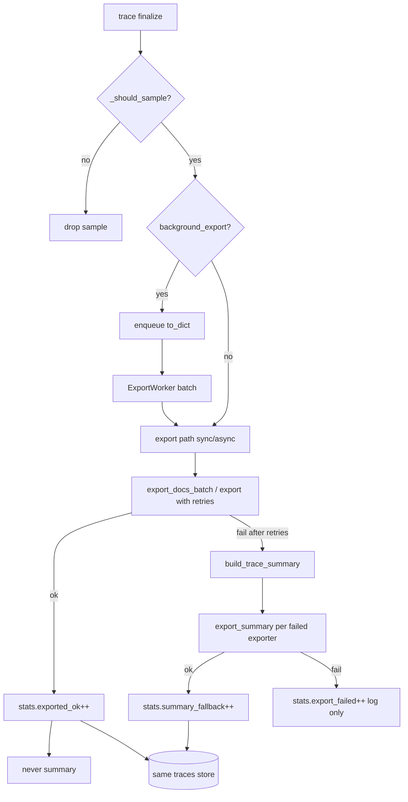

# Export Resilience — Design

**Spec**: `.specs/features/export-resilience/spec.md`  
**Status**: Draft → ready for Tasks  
**Stack**: Python `tracecast-py` + React dashboard (estático)

---

## Architecture Overview

Estende o pipeline de export existente (sync `_export` e worker `_export_batch_items`) com:

1. **Retry** em volta do full write  
2. **Summary builder** (dict enxuto)  
3. **`export_summary`** por exporter  
4. **ExportStats** no Tracer (contadores)  
5. **Health API** + badge de UI  



Princípios (alinhados ao código atual):

- Request path **nunca** bloqueia em retry longo quando `background_export=True` (retry no worker).
- Summary é **sempre dict pequeno** — sem input/output de spans.
- Mesmo `trace_id` do full → upsert de summary não cria id órfão.
- Falha de summary **nunca** propaga para a app.

---

## Code Reuse Analysis

### Existing components

| Component | Location | How to use |
|-----------|----------|------------|
| `Tracer._export` / `_export_batch_items` | `core/tracer.py` | Envolver com retry + fallback |
| `ExportWorker` | `core/export_queue.py` | Sem mudança de contrato; batch já chama `_export_batch_items` |
| `approx_trace_bytes` / truncate | `export_queue.py`, `payload.py` | Summary ignora spans I/O |
| `BaseExporter.export_docs_batch` | `exporters/base.py` | + `export_summary` default no-op seguro |
| Mongo/Postgres/Json/Dict exporters | `exporters/*` | Implementar `export_summary` reusando upsert/append |
| `_hydrate_trace` | `dashboard/reader.py` | Defaults para `export_status`, spans vazios |
| `_trace_summary` / list API | `dashboard/aggregator.py`, `router.py` | Expor flag partial |
| `/api/health` | `dashboard/router.py` | Estender payload |
| Contador `ExportWorker.dropped` | `export_queue.py` | Feed em `ExportStats.queue_dropped` |

### Integration points

| System | Method |
|--------|--------|
| Dashboard mount | `Tracer.mount` passa stats via reader ou closure no router |
| Standalone server | Health read-only sem stats de export (ou zeros) |
| `on_export_error` | Chamado após falha full (antes/depois summary); não quebra se receber dict |

### Concerns mitigados (CONCERNS.md histórico)

| Concern | Mitigação neste design |
|---------|------------------------|
| C9 perda silenciosa | Summary + contadores + health |
| OOM / VM pequena | Summary minúsculo; list projection P2 |
| Multi-exporter partial failure | Summary só no exporter que falhou |

---

## Data Model

### Wire: full trace (existente)

Sem breaking change. Campos novos **opcionais** no full:

```json
{
  "export_status": "complete",
  "schema_version": 2,
  "spans": [ "... full ..." ]
}
```

Full bem-sucedido pode omitir `export_status` (reader default = `"complete"`).

### Wire: trace summary (novo)

```json
{
  "schema_version": 2,
  "trace_id": "uuid",
  "name": "POST /chat",
  "project_id": "suporte",
  "project_name": "Support Bot",
  "model": "gpt-4o-mini",
  "session_id": null,
  "user_id": null,
  "total_tokens_in": 1200,
  "total_tokens_out": 340,
  "total_tokens_in_cached": 0,
  "total_tokens": 1540,
  "cost_usd": 0.0021,
  "latency_ms": 1820,
  "tools_used": {},
  "spans": [],
  "edges": [],
  "metadata": {},
  "started_at": "2026-07-09T12:00:00+00:00",
  "finished_at": "2026-07-09T12:00:01.820000+00:00",
  "export_status": "summary_only",
  "export_error": "ServerSelectionTimeoutError: ...",
  "is_summary": true
}
```

**Campos mínimos obrigatórios no builder (FB-02):**  
`trace_id`, `started_at`, `name`, `total_tokens` (e in/out se disponíveis), `project_id` **ou** `project_name` se presentes no original, `export_status`, `spans=[]`.

### Python helper

```text
core/trace_summary.py
  build_trace_summary(source: Trace | dict, error: BaseException | str) -> dict
```

Regras:

- Aceitar `Trace` ou `dict` (path background já serializa).
- Truncar `export_error` a 500 chars.
- Copiar só campos escalares listados; **nunca** copiar `spans`/`edges` do source.
- `is_summary: True` + `export_status: "summary_only"`.

---

## Components

### 1. `ExportStats` (novo)

- **Location:** `core/export_stats.py`
- **Purpose:** Contadores thread-safe leves para health
- **Interface:**
  - `incr(name: str, n: int = 1) -> None`
  - `set_last_error(msg: str) -> None`
  - `snapshot() -> dict`
- **Fields:** `exported_ok`, `export_failed`, `export_retried`, `summary_fallback`, `queue_dropped`, `last_error`, `last_error_at`
- **Threading:** `threading.Lock` (worker + request path)

### 2. Retry helper

- **Location:** `core/export_retry.py` (ou funções em `tracer.py` se preferir um arquivo só — preferir módulo pequeno)
- **Interface:**
  - `retry_call(fn, *, attempts, base_delay, on_retry=None) -> Any` raises last exc
- **Config:** env `TRACECAST_EXPORT_RETRIES` (default 3), `TRACECAST_EXPORT_RETRY_BASE` (default 0.2)

### 3. `Tracer` changes

- **Location:** `core/tracer.py`
- **Holds:** `self.stats: ExportStats`
- **`_export(trace)`:**
  1. For each exporter: `retry` → `export(trace)`  
  2. On final fail: `build_trace_summary` → `export_summary` → stats  
  3. `on_export_error` still called on final full fail  
  4. `online_eval` only if pelo menos um full export ok (ou manter comportamento atual se full ok em qualquer exporter — **decisão:** online_eval roda se **qualquer** full ok; se todos full fail, **não** roda)
- **`_export_batch_items(docs)`:**
  - Por doc, por exporter: retry `export_doc`/`export_docs_batch`  
  - Batch optimization: tentar `export_docs_batch` uma vez com retry; se o batch inteiro falhar, **fallback por item** (retry single `export_doc` → summary do item). Assim um doc ruim não mata o batch inteiro sem summary individual.
- **Queue dropped:** opcionalmente passar callback ao `ExportWorker` para `stats.incr("queue_dropped")` (estender `ExportWorker.enqueue` hook ou polled snapshot de `worker.dropped` no health)

**Decisão batch fail:**  
Se `export_docs_batch` falhar após retries → para cada doc do batch: tentar `export_doc` com 1 retry; se falhar → summary. Evita “1 doc tóxico = N summaries perdidos”.

### 4. `BaseExporter.export_summary`

```python
def export_summary(self, summary: dict) -> None:
    """Persist minimal trace summary. Default: export_doc(summary)."""
    self.export_doc(summary)
```

Exporters concretos:

| Exporter | Comportamento |
|----------|----------------|
| `DictExporter` | append em `traces` (ou lista `summaries`? **mesma lista** com flag) |
| `JsonFileExporter` | append JSONL na mesma path |
| `MongoExporter` | `replace_one` upsert por `trace_id` (mesmo col) |
| `PostgresExporter` | upsert row; `spans` JSONB `[]` |

Postgres: garantir colunas existentes; campos novos `export_status` / `export_error` podem ir em `metadata` JSONB se schema rígido não tiver colunas — **decisão:**

- **Mongo/JSONL/Dict:** campos top-level no doc  
- **Postgres:** se `_columns` não incluem `export_status`, embutir em `metadata`:
  - `metadata["_export_status"]`, `metadata["_export_error"]`, `metadata["_is_summary"]`  
  - Reader hidrata de volta para top-level se metadata tiver esses keys  

Isso evita migration obrigatória de schema PG no MVP.

### 5. Reader / hydrate

- `_hydrate_trace`: ler `export_status`, `is_summary`, `export_error`  
- `_trace_summary` (aggregator): incluir `export_status`, `is_summary` para a lista  
- `get_trace` / graph: summary → graph vazio

### 6. Health endpoint

Estender resposta atual de `/api/health`:

```json
{
  "status": "ok",
  "export": {
    "exported_ok": 10,
    "export_failed": 1,
    "export_retried": 2,
    "summary_fallback": 1,
    "queue_dropped": 0,
    "queue_size": 3,
    "queue_max": 100,
    "background_export": true,
    "last_error": "...",
    "last_error_at": "..."
  }
}
```

**Como o router acessa stats:**  
- Em `mount`, guardar `reader.export_stats = tracer.stats` e `reader.export_worker = tracer._export_worker`  
- Ou passar `health_provider: Callable[[], dict]` no `_make_router`  
Preferência: **atributos opcionais no TraceReader** setados em `mount` / standalone (`None` → export null).

### 7. Frontend (P1 mínimo)

| File | Change |
|------|--------|
| `pages/Traces.tsx` | Badge “partial” / “summary” se `is_summary` ou `export_status==="summary_only"` |
| `pages/TraceDetail.tsx` | Banner se summary; esconder grafo ou empty state |
| `hooks/useApi.ts` | tipagem se houver |

P3 Overview card: `pages/Overview.tsx` fetch health.

### 8. Warn `background_export` (P2)

Em `Tracer.__init__`, se algum exporter for Mongo/Postgres/JsonFile e `not background_export`: `warnings.warn(...)`.

### 9. List projection (P2)

- Mongo `query`: `projection` excluindo `spans.input`, `spans.output` **ou** strip no reader após query de lista  
- Postgres: `SELECT` sem trazer JSONB spans inteiro na listagem — se difícil no schema atual, strip no reader:

```python
def _strip_span_payloads(doc):
    for s in doc.get("spans") or []:
        s.pop("input", None); s.pop("output", None)
```

Só no path de **list/query_page**, não em `get(trace_id)`.

---

## Error Handling Matrix

| Event | Log | Stats | Persist | App |
|-------|-----|-------|---------|-----|
| Full ok | - | exported_ok | full | ok |
| Full fail, retry mid | debug/warn | export_retried | - | ok |
| Full fail final | warning | export_failed (temp) | try summary | ok |
| Summary ok | info/warn once | summary_fallback | summary | ok |
| Summary fail | warning | export_failed | - | ok |
| Queue full | warning rate-limited | queue_dropped | - | ok |
| Sample drop | - | - | - | ok |

---

## Config / Env

| Env | Default | Purpose |
|-----|---------|---------|
| `TRACECAST_EXPORT_RETRIES` | `3` | tentativas full |
| `TRACECAST_EXPORT_RETRY_BASE` | `0.2` | segundos base backoff |
| (existentes) `TRACECAST_EXPORT_QUEUE`, `FLUSH_*`, `SAMPLE_RATE`, `MAX_PAYLOAD_CHARS` | | sem mudança de semântica |

---

## Testing Strategy

| Layer | What |
|-------|------|
| Unit | `build_trace_summary` fields; retry counts; stats snapshot |
| Unit | Tracer + failing exporter → summary in DictExporter |
| Unit | Multi-exporter: one fails → summary only there; other has full |
| Unit | Batch: one bad doc after batch fail → per-item summary |
| Unit | Health snapshot shape |
| Integration (router) | health JSON; get summary trace; graph empty |
| Frontend | manual / light if no component test harness |

**Gate:** `cd packages/tracecast-py && python -m pytest tests/ -q`  
**TDD imutável:** testes da fase 1 derivados do spec (FB-*, RT-*, HL-*) não se editam para “passar” — só via mudança de spec.

---

## Rollout

1. Core summary + retry + stats (sem UI)  
2. Exporters  
3. Reader + health API  
4. Frontend badge/banner  
5. P2 warn + projection  
6. P3 overview card  

Deploy: usuários só precisam atualizar o pacote; summary aparece automaticamente em falhas. Dashboard rebuild se UI mudar.

---

## Non-goals (design)

- Não criar collection `trace_summaries` separada no MVP  
- Não garantir delivery cross-restart (sem spool)  
- Não mudar schema_version para 3 (campos opcionais em v2)
