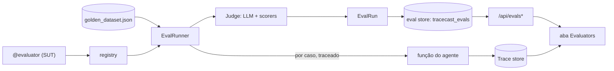

# Design — Evaluation por Golden Dataset

> Cobre `spec.md`. Reusa tracer, exporters, dashboard da feature `observability-reliability`.
> Novo subpacote: `tracecast/eval/`.

## 1. Visão geral



Disparo: `tracecast-eval` (CLI) · `run_evaluation(...)` (script) · `POST /api/evals/run` (só embutido).

## 2. Estrutura de arquivos (novos)

```
tracecast/eval/
├── __init__.py          # exports: evaluator, run_evaluation, LLMJudge, scorers
├── decorator.py         # @evaluator + registry
├── dataset.py           # loader/validador JSON → GoldenDataset/GoldenCase
├── models.py            # EvalRun, EvalCase, TurnResult, CriterionScore (+ to_dict/from_dict)
├── runner.py            # run_evaluation(): orquestra execução + judge + persistência
├── judge.py             # LLMJudge (rubrica) + protocolo Judge
├── scorers.py           # exact_match, contains, regex, similarity
└── cli.py               # entrypoint tracecast-eval
tracecast/exporters/      # + métodos export_eval/query_evals/get_eval (Mongo/Postgres/JSONL/Dict)
tracecast/dashboard/      # + rotas /api/evals*, eval_reader, eval aggregator
tracecast-dashboard/src/pages/   # Evaluators.tsx, EvalRunDetail.tsx
```

## 3. Schema do golden dataset (JSON)

```json
{
  "name": "suporte-v1",
  "criteria": [
    {"name": "faithfulness", "description": "A resposta é fiel ao expected, sem inventar?"},
    {"name": "relevance",    "description": "Responde de fato à pergunta?"}
  ],
  "threshold": 0.7,
  "cases": [
    {"id": "c1", "input": "Qual o horário de atendimento?", "expected": "08h às 18h",
     "metadata": {"tag": "faq"}},

    {"id": "c2",
     "turns": [
       {"role": "user", "content": "Quero cancelar meu pedido"},
       {"role": "assistant", "expected": "Confirma o número do pedido para cancelar."},
       {"role": "user", "content": "Pedido 123"},
       {"role": "assistant", "expected": "Pedido 123 cancelado."}
     ]}
  ]
}
```

- `criteria`/`threshold` no dataset são defaults; o `@evaluator` pode sobrescrever.
- Single-turn é açúcar para um caso de 1 turn (`user`→`assistant`).
- `dataset.py` normaliza tudo para `GoldenCase(turns=[GoldenTurn(role, content?, expected?)])`.

## 4. Modelo de dados (`eval/models.py`)

```
CriterionScore: name, score(0-1), reasoning, kind("llm"|"deterministic")
TurnResult:     index, role, input, output, expected, scores:[CriterionScore], overall_score, passed
EvalCase:       case_id, status("pass"|"fail"|"error"), overall_score, passed,
                turns:[TurnResult], trace_id, error, metadata
EvalRun:        run_id, name, dataset_name, dataset_path, target, project_id,
                judge_model, criteria:[str], threshold,
                started_at, finished_at, latency_ms,
                total_cases, passed, failed, pass_rate, avg_score,
                judge_tokens, judge_cost_usd,
                cases:[EvalCase], metadata, schema_version=1
```

`to_dict()`/`from_dict()` em todos; agregados calculados em `EvalRun.finalize()`.

## 5. Decorator + registry (`eval/decorator.py`)

```python
@evaluator(dataset="golden/suporte.json", name="suporte-bot",
           criteria=[...], scorers=["contains"], threshold=0.7, project_id="suporte")
def agent(input_text: str) -> str: ...        # SUT; retorna a resposta da LLM
```

- Registra `EvalTarget(name, fn, datasets, judge_cfg, scorers, threshold, project_id)` num registry
  module-level. **Transparente**: `wrapper(*a, **k)` apenas chama `fn` (FR-1.2).
- Multi-turn: a fn alvo pode aceitar `(input_text)` (stateless) ou `(messages: list)` — o runner
  detecta a aridade; por padrão passa o histórico acumulado de turns até o turn de assistant atual.

## 6. Runner (`eval/runner.py`)

```python
def run_evaluation(target, *, exporters, judge=None, tracer=None, project_id=None) -> EvalRun
```

Por caso:
1. Abre um trace (`tracer.trace(name=f"eval:{case_id}")`) → captura grafo do SUT; guarda `trace_id`.
2. Para cada turn de assistant: chama a fn alvo com o histórico até ali → `output`.
3. Roda scorers determinísticos (output vs expected) + `judge.score(turn, criteria)`.
4. `TurnResult` agrega scores → `overall_score`, `passed = overall >= threshold`.
5. `EvalCase` agrega turns; `status` = error se exceção.
Run agrega `pass_rate`, `avg_score`, soma `judge_tokens/cost`, persiste via exporters (`export_eval`).
Erros de caso isolados (FR-2.4). Persistência reusa o tratamento de erro do tracer (FR-4.3).

## 7. Judge (`eval/judge.py`) + scorers (`eval/scorers.py`)

```python
class Judge(Protocol):
    def score(self, *, input, output, expected, criteria) -> list[CriterionScore]: ...

class LLMJudge:                      # default
    def __init__(self, model="gpt-4o-mini", call_fn=None): ...
    # monta prompt com rubrica, pede JSON {criterion: {score, reasoning}},
    # parseia robusto (extrai bloco JSON), calcula cost via calculate_cost.
```

- `call_fn` injetável (default usa OpenAI/Anthropic via wrappers existentes) → mockável (FR-3.4).
- Scorers: funções `(output, expected) -> CriterionScore(kind="deterministic")`. Registro por nome.
- Resposta do judge sem JSON válido → score 0 + reasoning="parse_error" (degrada, não quebra a run).

## 8. CLI + Endpoint (`eval/cli.py`, router)

- CLI `tracecast-eval`:
  ```
  tracecast-eval --target mymod:agent --store mongodb://... [--dataset path] [--judge-model ...]
  ```
  Importa o módulo do target, resolve no registry, constrói exporters via `build_exporter_from_dsn`
  (reusa `serve.py`), roda `run_evaluation`, imprime resumo, exit code != 0 se `pass_rate < threshold`
  (útil em CI).
- Script: `from tracecast.eval import run_evaluation` (mesmo motor).
- Endpoint `POST /api/evals/run` (só quando dashboard embutido; checa registry em memória) → dispara em
  background task, retorna `run_id`. Standalone retorna 501/desabilitado (AD-3).

## 9. Persistência (`exporters/*`)

Adicionar métodos opcionais (Protocol `EvalReadable`/`EvalWritable`):
- `export_eval(run: EvalRun)` — Mongo: `replace_one({run_id}, doc, upsert=True)` em coleção
  `{collection}_evals`; Postgres: tabela `{table}_evals` (JSONB `cases`), `ON CONFLICT(run_id)`;
  JSONL: append em `{path}.evals.jsonl`; Dict: lista própria.
- `query_evals(...)`/`get_eval(run_id)` — filtros dataset/project/data; pushdown como nos traces.
Reader: `EvalReader` espelha `TraceReader` (cache + pushdown + fallback in-memory).

## 10. Dashboard

- Backend: rotas no router — `GET /api/evals` (lista+filtros), `GET /api/evals/{run_id}` (detalhe
  completo com casos/turns/scores). Aggregator `eval_summary`.
- Frontend:
  - `Layout` NAV_ITEMS += `{ to: "/evals", label: "Evaluators" }`.
  - `pages/Evaluators.tsx`: tabela de runs (dataset, data, pass_rate, avg_score) + filtros.
  - `pages/EvalRunDetail.tsx`: header do run; lista de casos; ao abrir um caso, painel por **turn**
    (input/output da LLM/expected) + tabela de critérios (score 0–1 + justificativa, cor por pass/fail);
    botão "ver trace" → `/traces/{trace_id}` (grafo já existente, FR-5.4).
  - Reusa `useApi` (prefix-aware) e estilos atuais.

## 11. Verificação (mapa de testes)

- Dataset: carrega single+multi-turn; rejeita malformado (FR-2.1).
- Decorator: transparente; registra target (FR-1.1/1.2/1.3).
- Runner: judge fake determinístico → scores/agregados/pass_rate corretos; caso com exceção vira error
  sem abortar; `trace_id` linkado (FR-2.*, FR-3.3).
- Judge: parse robusto de JSON ruidoso; custo contabilizado (FR-3.1, NFR-3.1). Scorers unitários (FR-3.2).
- Persistência: round-trip por exporter; upsert por run_id (FR-4.1/4.2).
- Dashboard: `/api/evals` filtra; `/api/evals/{id}` traz casos/turns/scores; aba e detalhe renderizam;
  link p/ trace (FR-5.*). Endpoint trigger só embutido.
