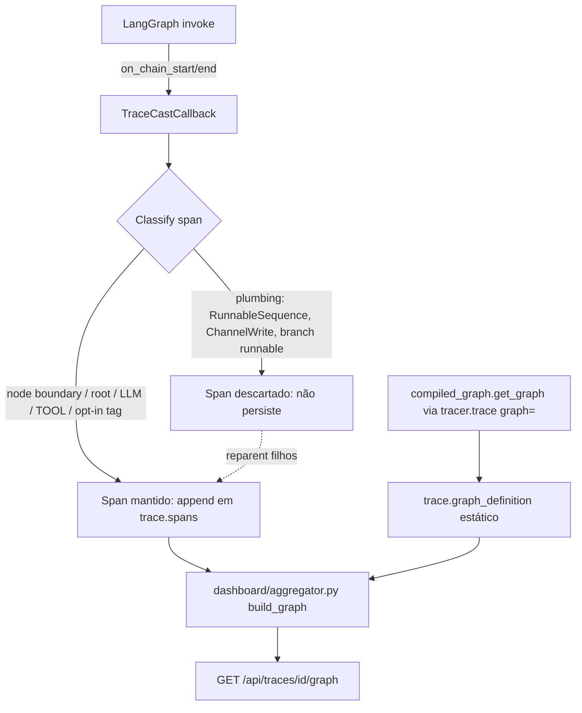

# LangGraph Native Spans — Design

**Spec**: `.specs/features/langgraph-native-spans/spec.md`
**Status**: Draft

---

## Evidência empírica (verificação antes de desenhar)

Rodado localmente contra `langgraph==1.0.1` (instalado no ambiente do projeto) com um grafo de 2
nodes e um handler de debug:

```
CHAIN_START name='LangGraph' langgraph_node=None  match=False parent=None        run=<root>
CHAIN_START name='node_a'    langgraph_node='node_a' match=True  parent=<root>   run=<a>
CHAIN_START name='node_b'    langgraph_node='node_b' match=True  parent=<root>   run=<b>
```

Confirma: (1) o run raiz (`name='LangGraph'`) não tem `langgraph_node` e não tem parent — é o
ponto de entrada; (2) cada node dispara exatamente um `on_chain_start` onde `name == langgraph_node`
— esse é o critério de boundary usado internamente pelo próprio LangGraph em
`langgraph/pregel/_messages.py` (`GraphBubbleUp`/mensagens), confirmado por leitura direta do
pacote instalado. `TAG_HIDDEN = "langsmith:hidden"` confirmado em `langgraph/constants.py`.

`compiled_graph.get_graph()` (via `introspect.signature` em `langchain_core.runnables.graph`,
pacote instalado):

```python
Node = namedtuple-like(id, name, data, metadata)
Edge = namedtuple-like(source, target, data, conditional)
Graph(nodes: dict[str, Node], edges: list[Edge])
```

Testado com branch condicional:

```
EDGE __start__ -> classify   cond=False data=None
EDGE classify  -> answer_a   cond=True  data='a'
EDGE classify  -> answer_b   cond=True  data='b'
EDGE answer_a  -> __end__    cond=False data=None
EDGE answer_b  -> __end__    cond=False data=None
```

`data` na edge condicional é exatamente o label de branch retornado pela função de roteamento —
dado real, não inferido.

**Nuance não totalmente verificada (marcar incerteza):** um exemplo de doc do LangGraph (via
Context7, projeto `langchain-ai/langgraph`) mostra `metadata["langgraph_step"]` em um cenário mais
complexo (subgrafo `conduct_research`); no teste local simples, o sinal de step veio como
**tag** `graph:step:N`, não como chave de metadata. Não depender de nenhum dos dois como
obrigatório — usar como *hint* opcional de ordenação, com fallback em `started_at` (que já existe
e já funciona).

---

## Architecture Overview



Toda a lógica nova vive em **uma** camada: o `TraceCastCallback` (captura) e um pequeno helper de
topologia (`integrations/langgraph.py`, novo arquivo). Nenhuma mudança em `models/span.py`,
`core/tracer.py` (exceto assinatura de `trace()`) ou nos exporters — a classificação acontece
inteiramente antes de um span virar `Span` persistido.

---

## Code Reuse Analysis

### Existing Components to Leverage

| Component | Location | How to Use |
| --------- | -------- | ---------- |
| `TraceCastCallback._span_stack` | `integrations/langchain.py:36` | Vira `dict[str, tuple[Span, bool]]` (span + flag `kept`) em vez de `dict[str, Span]` |
| `TraceCastCallback._parent_id` | `integrations/langchain.py:48-58` | Reescrito para pular ancestrais `plumbing` (reparenting) |
| `Span.metadata` (`tc_display`, `tc_order`) | `models/span.py` | Mantido como estava para compatibilidade com `aggregator.py` — mas agora só é setado em spans já `kept` |
| `aggregator._is_curated` / `_build_graph_curated` | `dashboard/aggregator.py:179,331` | Vira o **fallback** quando `trace.graph_definition` não existe (P2, critério 3) |
| `Tracer.current_span()` | `core/tracer.py` | Usado sem mudança na resolução de parent quando não há `parent_run_id` |
| `Trace` model | `models/trace.py` | Ganha campo opcional `graph_definition: Optional[dict] = None` (serializável, não obrigatório — exporters antigos ignoram campo desconhecido com segurança, mesmo padrão de degradação graciosa já usado no projeto) |

### Integration Points

| System | Integration Method |
| ------ | ------------------- |
| `TraceCastCallback.on_chain_start/on_chain_end` | Nova lógica de classificação + descarte condicional |
| `Tracer.trace()` | Novo parâmetro opcional `graph=` para capturar topologia uma vez por invocação |
| `dashboard/aggregator.build_graph()` | Novo branch: se `trace.graph_definition` existe, usa `_build_graph_from_definition` (nova função) antes de cair nos branches existentes |
| Exporters (Mongo/Postgres/JSONL/Dict) | Nenhuma mudança de schema obrigatória — `graph_definition` viaja dentro de `trace.to_dict()` como os demais campos opcionais já fazem |

---

## Components

### 1. `SpanClassifier` (função pura, dentro de `integrations/langchain.py`)

- **Purpose**: decidir se um span recém-aberto é `kept` ou `plumbing`, no momento do
  `on_chain_start` (chains) — LLM e Tool são sempre `kept`, decidido nos próprios
  `on_llm_start`/`on_tool_start` sem precisar desta função.
- **Location**: `tracecast/integrations/langchain.py` (função módulo-nível, não método, para ficar
  testável isoladamente)
- **Interfaces**:
  - `_classify_chain_span(name: str, metadata: dict, tags: list[str], has_parent: bool, keep_tags: frozenset[str]) -> bool`
    — `True` = manter.
- **Dependências**: nenhuma (função pura sobre os kwargs do callback)
- **Reuses**: nada — é lógica nova, mas isolada e pequena (≤15 linhas)

Lógica exata:

```python
def _classify_chain_span(name, metadata, tags, has_parent, keep_tags):
    tags = tags or []
    if keep_tags.intersection(tags):
        return True
    if not has_parent:
        return True  # raiz da invocação
    node_name = (metadata or {}).get("langgraph_node")
    if node_name is not None and name == node_name and "langsmith:hidden" not in tags:
        return True  # node boundary real
    return False  # plumbing: RunnableSequence, ChannelWrite, branch runnable, chain aninhada dentro do node
```

### 2. `TraceCastCallback` (modificado)

- **Purpose**: mesmo papel de hoje, mas com `_span_stack` guardando `(Span, kept: bool)` e
  `_parent_id` reparentando através de ancestrais descartados.
- **Location**: `tracecast/integrations/langchain.py`
- **Interfaces** (mudam de assinatura interna, API pública inalterada):
  - `__init__(self, tracer: Tracer, span_capture: Literal["curated", "all"] = "curated", keep_tags: frozenset[str] = frozenset({"tracecast:keep"}))`
  - `_parent_id(kwargs) -> Optional[str]` — reescrito (ver abaixo)
- **Dependências**: `SpanClassifier`
- **Reuses**: toda a lógica de extração de tokens/custo/nome permanece idêntica; só a decisão de
  "append em `trace.spans` ou não" muda.

`_parent_id` reescrito:

```python
def _parent_id(self, kwargs) -> Optional[str]:
    parent_run_id = kwargs.get("parent_run_id")
    if parent_run_id:
        entry = self._span_stack.get(str(parent_run_id))
        if entry is not None:
            parent_span, parent_kept = entry
            return parent_span.span_id if parent_kept else parent_span.parent_span_id
    ctx_span = Tracer.current_span()
    return ctx_span.span_id if ctx_span else None
```

Isso funciona porque `parent_span.parent_span_id` de um span `plumbing` **já foi resolvido** (na
hora em que ele próprio foi criado) para o ancestral mantido mais próximo — resolução é
recursiva por construção, sem precisar caminhar a árvore toda a cada novo span (O(1) por span).

`on_chain_start` (chains) passa a computar `kept` e só setar `metadata={"tc_display": True}` (like
hoje) quando `kept and is_node_boundary` (preserva o contrato existente do `aggregator.py`, que já
lê `tc_display`).

`on_chain_end` / `on_llm_end` / `on_tool_end`: `trace.spans.append(span)` só roda quando
`span_capture == "all"` OR `kept is True`. LLM/Tool: `kept` sempre `True`, então nenhuma mudança
visível de comportamento pra eles.

`on_chain_error` / `_close_span_with_error`: mesma regra (só grava span de erro se `kept`).

### 3. `capture_graph_topology` (novo módulo `tracecast/integrations/langgraph.py`)

- **Purpose**: extrair `nodes`/`edges` de `compiled_graph.get_graph()` num dict serializável.
- **Location**: `tracecast/integrations/langgraph.py` (novo arquivo — integração dedicada, mesmo
  padrão de `integrations/langchain.py`)
- **Interfaces**:
  - `capture_graph_topology(compiled_graph) -> Optional[dict]` — retorna
    `{"nodes": [{"id": str, "name": str}], "edges": [{"source": str, "target": str, "conditional": bool, "label": str | None}]}`
    ou `None` se `compiled_graph` não expõe `get_graph()` ou a chamada falha (degradação
    graciosa — loga warning via `warnings.warn`, mesmo padrão de `core/tracer.py`).
- **Dependências**: nenhuma import obrigatória de `langgraph` no topo do módulo — `get_graph()` é
  chamado via `getattr(compiled_graph, "get_graph", None)`, então o módulo funciona mesmo sem
  `langgraph` instalado (mesmo padrão de optional-dependency dos exporters Mongo/Postgres).
- **Reuses**: nada existente — capability nova.

### 4. `Tracer.trace()` (modificado)

- **Purpose**: aceitar `graph=` opcional e anexar `graph_definition` ao `Trace` no início.
- **Location**: `tracecast/core/tracer.py`
- **Interfaces**: `trace(self, name: str, *, graph: Optional[Any] = None, **kwargs)` — `graph` não
  documentado como tipo `CompiledGraph` (evita import obrigatório de langgraph em `core/`); aceita
  qualquer objeto com `.get_graph()`.
- **Dependências**: `integrations.langgraph.capture_graph_topology` (import local, dentro do
  método, para não criar dependência de import-time de `langgraph` no `core/`)
- **Reuses**: `Trace.__init__` existente, só ganha um campo a mais.

### 5. `dashboard/aggregator._build_graph_from_definition` (nova função)

- **Purpose**: montar o grafo do endpoint `/graph` a partir de `trace.graph_definition` +
  spans executados, marcando nodes não executados com `executed=false`.
- **Location**: `tracecast/dashboard/aggregator.py`
- **Interfaces**: `_build_graph_from_definition(trace: Trace, valid_spans: list) -> dict` — mesma
  forma de retorno das funções `_build_graph_curated`/fallback existentes (`nodes`, `edges`,
  totais de tokens/custo), para o endpoint não precisar mudar.
- **Dependências**: nenhuma nova
- **Reuses**: `_node_from_calls`, `_llm_call`, `_parse_tool_params` (funções já existentes,
  reaproveitadas sem mudança)
- **Regra de match node-definição ↔ node-executado**: por `name` (o node definido em
  `graph_definition` tem `name` igual ao `Span.name` do node boundary correspondente, garantido
  pela regra `name == langgraph_node` do classificador). `__start__`/`__end__` do
  `get_graph()` não têm span correspondente — mapeados para o span raiz (`__start__`) e omitidos
  (`__end__`, é só marcador terminal do LangGraph, não uma execução real).

`build_graph()` (função existente, `dashboard/aggregator.py:218`) ganha uma linha no topo:

```python
if getattr(trace, "graph_definition", None):
    return _build_graph_from_definition(trace, valid_spans)
# ... resto do fluxo atual (curated / fallback) inalterado
```

---

## Data Models

### `Trace` (extensão, não substituição)

```python
@dataclass
class Trace:
    # ... campos existentes inalterados ...
    graph_definition: Optional[dict] = None  # {"nodes": [...], "edges": [...]}
```

Campo opcional com default `None` — `to_dict()`/`from_dict()` seguem o padrão já usado para os
demais campos opcionais do schema v2 (leitura retrocompatível: trace antigo sem o campo carrega
`None`).

---

## Error Handling Strategy

| Error Scenario | Handling | User Impact |
| --------------- | -------- | ------------ |
| `compiled_graph.get_graph()` lança exceção (versão incompatível, grafo malformado) | `capture_graph_topology` captura, loga `warnings.warn`, retorna `None` | Trace segue normalmente sem `graph_definition`; dashboard cai no fallback atual |
| `metadata` ausente em `on_chain_start` (chain não-LangGraph) | `_classify_chain_span` trata `metadata=None` como `{}`, `node_name=None` → nunca é node boundary, só é `kept` se raiz ou tag opt-in | Comportamento idêntico ao atual para chains LangChain puras (sem regressão) |
| `span_capture="all"` | Bypassa toda a classificação — `kept` sempre `True` | Paridade total com comportamento pré-feature, para debug/comparação |
| Node do `graph_definition` sem span correspondente (branch não tomada) | `_build_graph_from_definition` inclui o node com `executed=false`, sem tentar sintetizar métricas | Dashboard mostra o node "apagado"/cinza, sem tokens/custo |

---

## Tech Decisions (only non-obvious ones)

| Decision | Choice | Rationale |
| -------- | ------ | --------- |
| Onde classificar: no callback (captura) vs. no dashboard (leitura) | **No callback, captura** | Objetivo explícito é reduzir ruído no storage, não só na UI — é a diferença real vs. Langfuse (que só esconde via tag, ainda grava tudo) |
| `plumbing` spans: manter rastreio em memória durante execução? | **Sim** (`_span_stack` guarda todos, `kept` só decide persistência) | Necessário para reparenting correto — descartar do stack perderia a capacidade de resolver `parent_span_id` dos filhos |
| Novo campo `graph_definition` no `Trace` em vez de tabela separada | **Campo no `Trace`** | Segue AD-1 do SDD anterior (menor superfície nova possível); grafo é estático por invocação, não precisa de query própria |
| Import de `langgraph` obrigatório em algum módulo `core/` | **Não** — sempre via `getattr`/import local | Mantém `langgraph` como dependência opcional, mesmo padrão dos exporters DB |
| Default de `span_capture` | **`"curated"`** (breaking change de comportamento, não de API) | É o pedido explícito do usuário; documentar no CHANGELOG. Quem depende do `"all"` (debug, comparação, testes de regressão) opta explicitamente. |
| Ordenação (`tc_order`) usar `langgraph_step` (metadata) ou tag `graph:step:N` | **Nenhum dos dois como obrigatório** — usar como hint opcional (parse de qualquer um que existir), fallback em `started_at` (já funciona) | Evidência empírica mostrou os dois formatos em cenários diferentes; não fabricar certeza sobre qual é estável entre versões |

---

## Tips (preenchido)

- Reuso confirmado: `_node_from_calls`, `_llm_call`, `_parse_tool_params`, `_is_curated`,
  `Tracer.current_span()` — nenhum reescrito, só reaproveitado.
- CONCERNS.md C2 é resolvido por este design (edges reais via `get_graph()`).
- CONCERNS.md C4 (decorator sozinho ≠ tracing do fluxo) não é afetado — fora de escopo.
