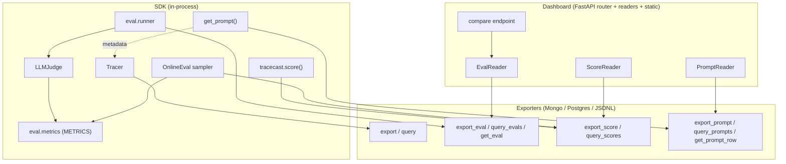

# Plataforma de Observabilidade — Design

**Spec**: `.specs/features/observability-platform/spec.md`
**Status**: Draft

---

## Arquitetura Geral

Nada de backend novo. Três novos domínios de dados (eval já existe como modelo; falta persistência),
todos plugados no **contrato de exporter** existente e no **dashboard** existente.



**Fluxo por fase:**
- Fase 0: `Runner → export_eval`; `EvalReader → query_evals/get_eval`.
- Fase 1: `score() → export_score`; `ScoreReader → query_scores` no detalhe do trace.
- Fase 2: `Runner/Judge → METRICS` (presets) — sem mudança de persistência.
- Fase 3: `compare() → EvalReader` (lê 2 runs já persistidos).
- Fase 4: `OnlineEval` engancha no export do tracer → `METRICS` → `export_score`. `add_to_dataset` mexe em JSON.
- Fase 5: `get_prompt()/create_prompt() → export_prompt/query_prompts`; injeta metadata no trace.

---

## Análise de Reuso

### Componentes existentes a alavancar

| Componente | Local | Como usar |
| ---------- | ----- | --------- |
| `BaseExporter` | `exporters/base.py` | Estender com métodos opcionais `export_<x>`/`query_<x>` (não-abstratos; default no-op/[]) |
| `MongoExporter` (`__init__`/`export`/`query`/`count`) | `exporters/mongo.py` | Adicionar coleções `tracecast_evals/scores/prompts` e métodos espelho |
| `PostgresExporter` (ON CONFLICT) | `exporters/postgres.py` | Mesmo padrão idempotente p/ novas tabelas |
| `JsonFileExporter` | `exporters/json_file.py` | Append/scan p/ novos domínios (arquivos irmãos) |
| `EvalReader` (`_readable`, `list_runs`, `get_run`) | `dashboard/eval_reader.py` | Já chama `query_evals/get_eval`; só faltam impls (Fase 0) |
| `LLMJudge.score(criteria=...)` | `eval/judge.py` | Métricas LLM são presets de `criteria` (Fase 2) |
| `SCORERS` + `run_scorer` | `eval/scorers.py` | Métricas heurísticas registram-se análogo (Fase 2) |
| `run_evaluation` | `eval/runner.py` | `compare` reusa runs que ele persiste (Fase 3) |
| `Tracer.trace(...)` + `metadata` do `Trace` | `core/tracer.py`, `models/trace.py` | `get_prompt` injeta `prompt_*` no `metadata`; online eval engancha no export |
| `_make_router(reader, prefix)` | `dashboard/router.py` | Novos endpoints REST reusam padrão `APIRouter` + `_parse_iso` |
| `build_exporter_from_dsn` | `serve.py` | CLIs novas resolvem exporter pelo mesmo DSN |
| `calculate_cost` | `core/cost_calculator.py` | Custo do judge nas métricas LLM |

### Pontos de integração

| Sistema | Integração |
| ------- | ---------- |
| Exporters | Novos métodos opcionais; ausência = degradação graciosa (AD-1) |
| Dashboard router | Novos endpoints `/api/scores`, `/api/evals/compare`, `/api/prompts` |
| Tracer export pipeline | OnlineEval intercepta pós-export (hook), sem alterar o caminho feliz |
| CONCERNS.md | Verificar áreas frágeis antes de mexer em exporters/tracer (ver §Concerns) |

---

## Componentes

### 1. Persistência de domínios nos exporters (Fase 0/1/5)

- **Purpose**: Implementar leitura/escrita de eval, score e prompt nos 3 exporters.
- **Location**: `exporters/{base,mongo,postgres,json_file}.py`
- **Interfaces** (adicionadas a `BaseExporter`, default no-op):
  - `export_eval(run: EvalRun) -> None`
  - `query_evals(*, project_id, dataset_name, from_dt, to_dt, limit, offset) -> list[dict]`
  - `get_eval(run_id: str) -> dict | None`
  - `export_score(score: Score) -> None`
  - `query_scores(*, trace_id=None, name=None, from_dt=None, to_dt=None, limit=100, offset=0) -> list[dict]`
  - `export_prompt(prompt: PromptVersion) -> None`
  - `query_prompts(*, name=None) -> list[dict]`
  - `get_prompt_row(name: str, *, label=None, version=None) -> dict | None`
- **Dependencies**: pymongo / psycopg2 / fs (já deps opcionais).
- **Reuses**: padrões `__init__`/`query`/`count` e `ON CONFLICT` existentes.

### 2. Score API + modelo (Fase 1)

- **Purpose**: Criar e validar `Score`, expor `tracecast.score(...)`.
- **Location**: `models/score.py`, `core/scoring.py` (função `score(...)`), export em `__init__.py`.
- **Interfaces**:
  - `score(trace_id, name, value, *, span_id=None, kind="human", data_type="numeric", comment=None, exporters=None) -> Score`
  - `Score.validate() -> None` (checa `value` × `data_type`)
- **Dependencies**: exporter configurado (ou default tracer exporters).
- **Reuses**: `Trace.metadata`, política try/except dos exporters.

### 3. Métricas (Fase 2)

- **Purpose**: Presets nomeados de avaliação.
- **Location**: `eval/metrics.py` (registry `METRICS`), integração em `judge.py`/`runner.py`.
- **Interfaces**:
  - `resolve_metrics(names: list[str]) -> list[Criterion]` (llm) e/ou heurísticas
  - `register_metric(name, spec)`
  - heurísticas seguem assinatura de `SCORERS`
- **Dependencies**: `LLMJudge`; `toxicity` opcionalmente `detoxify` (import lazy, fallback lista de termos).
- **Reuses**: `LLMJudge.score`, `SCORERS`, `calculate_cost`.

### 4. Compare (Fase 3)

- **Purpose**: Diff de dois `EvalRun`.
- **Location**: `eval/compare.py`; endpoint em `dashboard/router.py`.
- **Interfaces**:
  - `compare(run_a: dict, run_b: dict) -> CompareResult` (alinha por `case_id`, calcula deltas)
- **Dependencies**: `EvalReader.get_run`.
- **Reuses**: `EvalRun.from_dict`, `EvalReader`.

### 5. OnlineEval + add_to_dataset (Fase 4)

- **Purpose**: Amostrar tráfego → métricas → score; promover trace a caso.
- **Location**: `eval/online.py`, `eval/dataset.py` (função `add_to_dataset`).
- **Interfaces**:
  - `OnlineEval(sample_rate: float, metrics: list[str], exporters: list)` com `maybe_evaluate(trace) -> None`
  - `add_to_dataset(trace_id, path, *, expected=None, reader=None) -> None`
- **Dependencies**: `METRICS`, `export_score`, reader p/ buscar o trace.
- **Reuses**: hook de export do `Tracer`; parser de dataset existente (`_normalize_case` inverso).

### 6. Prompt management (Fase 5)

- **Purpose**: Prompts versionados, fetch por label, cache, auto-link.
- **Location**: `prompts/` (`models.py`, `client.py`), export em `__init__.py`.
- **Interfaces**:
  - `create_prompt(name, template, *, labels=None, exporters=None) -> PromptVersion` (versão = max+1)
  - `set_label(name, version, label)`
  - `get_prompt(name, *, label="production", version=None) -> PromptVersion` (cache TTL)
- **Dependencies**: exporter de prompt; `Tracer` corrente (p/ metadata).
- **Reuses**: contrato de exporter (AD-1); `bind_context` p/ achar o trace ativo.

### 7. Dashboard — novos readers/endpoints/abas

- **Purpose**: Surface dos novos dados.
- **Location**: `dashboard/{score_reader,prompt_reader}.py`, `dashboard/router.py`, static (abas Scores em trace detail, Compare, Prompts).
- **Interfaces (REST)**:
  - `GET /api/traces/{id}/scores`
  - `GET /api/evals/compare?a=...&b=...`
  - `GET /api/prompts`, `GET /api/prompts/{name}`
- **Reuses**: `_make_router`, `EvalReader` (`_readable` pattern).

---

## Modelos de Dados

### Score (novo)

```python
@dataclass
class Score:
    score_id: str          # uuid
    trace_id: str          # obrigatório
    name: str              # ex.: "user_feedback", "faithfulness"
    value: float           # numeric; boolean -> 0/1; categorical -> índice + label em metadata
    span_id: Optional[str] = None
    kind: str = "human"          # human | llm | heuristic
    data_type: str = "numeric"   # numeric | boolean | categorical
    string_value: Optional[str] = None   # label p/ categorical
    comment: Optional[str] = None
    source: Optional[str] = None          # "sdk" | "online_eval" | "annotation"
    project_id: Optional[str] = None
    created_at: datetime = field(default_factory=...)
    metadata: Dict[str, Any] = field(default_factory=dict)
```
**Validação:** `numeric`→float qualquer; `boolean`→value ∈ {0,1}; `categorical`→exige `string_value`.
**Relação:** N:1 com `Trace` (via `trace_id`), opcional N:1 com span (`span_id`).
**Persistência:** coleção/tabela `tracecast_scores`; índice por `trace_id`.

### PromptVersion (novo)

```python
@dataclass
class PromptVersion:
    name: str
    version: int               # incremental por name
    template: str              # texto (com {var})
    labels: List[str]          # ex.: ["production"], ["staging"]
    config: Dict[str, Any]     # opcional (model, temperature)
    created_at: datetime
    prompt_id: str             # uuid da versão
```
**Regra:** versão é imutável; `set_label` move o label (um label aponta p/ no máx. 1 versão por name).
**Persistência:** `tracecast_prompts`; chave lógica (`name`,`version`). Postgres: PK (`name`,`version`),
índice por label.

### EvalRun (existente — só ganha persistência)

Sem mudança de schema. `to_dict()`/`from_dict()` já existem em `eval/models.py`. Persistir em
`tracecast_evals`, PK `run_id` (Postgres `ON CONFLICT (run_id) DO UPDATE`).

### CompareResult (efêmero, não persistido)

```python
@dataclass
class CompareResult:
    run_a: str; run_b: str
    dataset_mismatch: bool
    avg_score_delta: float; pass_rate_delta: float
    cases: List[dict]   # {case_id, score_a, score_b, delta, status: changed|added|removed}
```

---

## Estratégia de Erros

| Cenário | Tratamento | Impacto no usuário |
| ------- | ---------- | ------------------ |
| Exporter sem `export_<x>` | no-op (AD-1) | Sem persistência daquele domínio; sem crash |
| Falha ao gravar score/eval/prompt | try/except + `_logger.error` (padrão atual) | App segue; warning no log |
| `value` inválido p/ `data_type` | `ValueError` antes de persistir | Erro claro no SDK |
| Métrica online falha | captura por métrica, score n/a | Trace intacto (AD-6) |
| `get_prompt` sem exporter de prompt | `RuntimeError` explicativo | Falha cedo e clara |
| `compare` com datasets diferentes | `dataset_mismatch=true`, segue | Aviso na UI |
| `add_to_dataset` em JSON inexistente | cria arquivo com `cases:[]` | Transparente |

---

## Decisões Técnicas (não óbvias)

| Decisão | Escolha | Razão |
| ------- | ------- | ----- |
| Métodos novos no exporter | opcionais no `BaseExporter` (default no-op/[]) | Mantém AD-1 e não quebra exporters de terceiros |
| Score categorical | `value` (índice) + `string_value` (label) | Permite agregação numérica e leitura humana na mesma linha |
| Online eval hook | pós-export, em `ThreadPool`/`asyncio.to_thread` | Não adiciona latência ao caminho do app (AD-6) |
| Cache de prompt | dict em memória + TTL | "sem latência após 1º fetch" (PROMPT-02) sem dep nova |
| Toxicity sem dep pesada | `detoxify` lazy; fallback heurístico | Mantém lib leve; dep opcional |
| Compare sem novo storage | recomputa a partir de runs persistidos | AD-5; zero schema novo |

---

## Concerns (de `.specs/codebase/CONCERNS.md`)

CONCERNS.md é a auditoria da feature irmã `observability-reliability` (2026-06-13), parcialmente
resolvida — ex.: C17 ("deletar `tracecast-ts`") explica por que `tracecast-ts/src` hoje só tem
`dashboard/` (valida AD-10). Itens que impactam ESTE design:

- **C9/C10 — export engole exceção / `aexport` bloqueante.** A Fase 4 (OnlineEval) engancha no
  pipeline de export do tracer. Já existe o hook `on_export_error(exc, trace, exporter)` no
  `Tracer.__init__` (`core/tracer.py:42`); o sampler deve seguir a mesma política best-effort e rodar
  fora do event loop (`asyncio.to_thread`/pool), sem regredir latência nem causar perda de trace.
- **C11 — Mongo `insert_one` sem upsert (Postgres já tem `ON CONFLICT`).** As novas escritas (eval,
  score, prompt) devem ser idempotentes: Mongo via `update_one(..., upsert=True)` por chave lógica
  (`run_id` / `score_id` / (`name`,`version`)); Postgres via `ON CONFLICT DO UPDATE`.
- **C15 — reader reusa conexão de escrita.** Os novos readers (`ScoreReader`, `PromptReader`) seguem o
  padrão `_readable` do `EvalReader`; não abrir novas conexões fora do exporter.

Cada task que toca o pipeline de export do tracer inclui teste que prova "trace não regride"
(latência e contagem de spans inalteradas com OnlineEval ligado).
