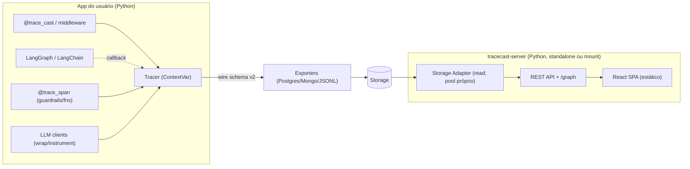
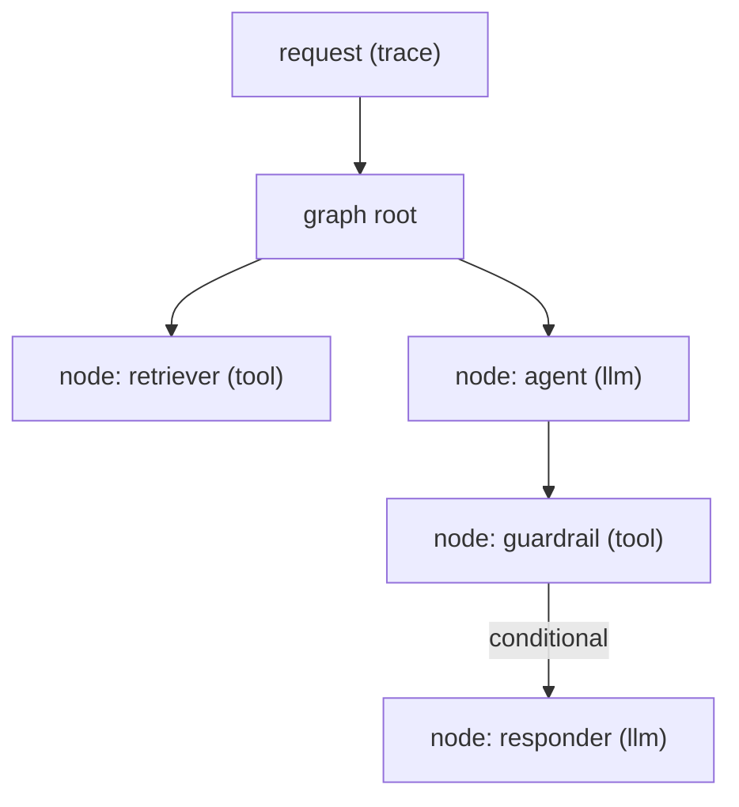

# Design — Observabilidade Confiável (Python-only)

> Cobre os requisitos de `spec.md`. Stack: **Python apenas** (SDK + backend) + React SPA (frontend
> estático servido pelo backend).

## 1. Arquitetura alvo



Componentes deletados: `packages/tracecast-ts/*` (AD-1). `packages/tracecast-dashboard` (React) **fica** —
é o frontend; compila e é servido por `dashboard/router.py`/`standalone.py`.

## 2. Schema de wire v2 (FR-1.1, FR-1.3, FR-2.1)

### Span (`models/span.py`)
Adicionar:
- `parent_span_id: Optional[str] = None` — pai na árvore de execução.
- `status: str = "ok"` — `"ok"` | `"error"`.
- `error: Optional[str] = None` — mensagem quando `status == "error"`.

`to_dict()` serializa os 3 novos campos. Retrocompat na leitura: `_hydrate_trace` default `parent_span_id=None`,
`status="ok"`.

### Trace (`models/trace.py`)
Adicionar:
- `edges: List[dict] = []` — arestas percorridas: `{"from": span_id, "to": span_id, "conditional": bool}`.

`edges` é **derivado** em `_finalize()` a partir de `parent_span_id` + ordem temporal (ver §3.2), não exige
internals do LangGraph. Campo de schema bump: `schema_version: int = 2` no `to_dict()`.

## 3. Captura

### 3.1 Hierarquia pai→filho (FR-1.1, FR-1.2)
O callback LangChain já recebe `run_id` e `parent_run_id`. Hoje `span_id == run_id`; basta **persistir o
pai**:
- Em cada `on_*_start`, setar `span.parent_span_id = str(parent_run_id) if parent_run_id else None`.
- Spans com `parent_run_id` que não é um span nosso (ou `None`) são **raiz** → pai lógico = a request
  (trace). LangGraph emite um `on_chain_start` raiz para o grafo; nós ficam como filhos dele.
- Idem em `integrations/llm.py` e instrumentors: aceitar `parent_span_id` opcional (ler `Tracer.current_span()`
  — novo ContextVar de span ativo para aninhar spans manuais).

### 3.2 Arestas / grafo percorrido (FR-1.3)
v0.3 deriva o **caminho executado** sem depender de internals:
- Agrupar spans por `parent_span_id`.
- Dentro de um grupo (irmãos sob o mesmo pai), ordenar por `started_at`.
- Aresta = `(span[i] → span[i+1])` consecutivos = transição real (cobre roteamento condicional, pois só
  o ramo tomado gera span).
- `conditional=True` quando o pai é um nó de grafo com >1 saída possível (heurística: pai tem irmãos
  alternativos em traces históricos — opcional; default `False`).
- **Enhancement opcional** (tarefa separada, não-bloqueante): instrumentor LangGraph nativo que lê
  `compiled_graph.get_graph().edges` no `compile()` para rótulos de aresta verdadeiros. Fica fora do MVP.

### 3.3 Propagação de contexto em threads (FR-1.4) — 🔴 C3
ContextVars propagam para tasks `asyncio` filhas, **não** para threads (`run_in_executor`, ThreadPool).
- Fornecer helper `tracecast.run_in_context(fn, *args)` que captura `contextvars.copy_context()` e roda
  `fn` dentro dele — para offload manual.
- `@trace_span` e wrappers de LLM, ao detectar execução em thread sem trace ativo, tentam recuperar via
  contexto capturado no momento da criação do span pai.
- Documentar o padrão LangGraph: passar o `config`/callbacks explicitamente propaga o handler mesmo entre
  threads (LangChain reinjeta via `config`). Teste cobre `run_in_executor`.

### 3.4 Funções arbitrárias / guardrails (FR-1.5)
Novo decorator `@trace_span(name=None, type=SpanType.TOOL)` em `decorators.py`:
- Cria um `Span` filho do span/trace ativo, captura `input` (args repr truncado), `output`, latência,
  `status`/`error` em exceção, e faz `trace.spans.append`.
- Versões sync e async (espelha `trace_cast`).

## 4. Confiabilidade do save (G3, best-effort)

### 4.1 Não engolir erros (FR-3.1) — 🔴 C9
`Tracer.__init__` aceita `on_export_error: Optional[Callable[[Exception, Trace, BaseExporter], None]]`.
`_export`/`_aexport`:
```
except Exception as exc:
    logger.error("export failed: %s", exc, exc_info=True)   # nível ERROR, não warn
    if self.on_export_error:
        self.on_export_error(exc, trace, exporter)
```

### 4.2 Async não-bloqueante (FR-3.2) — 🟠 C10
`BaseExporter.aexport` default passa a usar `await asyncio.to_thread(self.export, trace)` (offload do
loop) em vez de chamar `export` inline. Drivers async (asyncpg/motor) ficam para v0.4.

### 4.3 Idempotência Mongo (FR-3.3) — 🟡 C11
`MongoExporter.export`: `self.col.replace_one({"trace_id": doc["trace_id"]}, doc, upsert=True)` +
índice único em `trace_id`. Postgres já tem `ON CONFLICT`.

## 5. Dashboard (G4)

### 5.1 Bug Mongo reader (FR-4.1) — 🔴 C12
`reader._from_mongo` lê `exporter._collection`; exporter expõe `self.col`. Corrigir para um contrato
único: renomear no exporter para `self._collection` (e manter `self.col` como alias deprecado) OU ler
`getattr(exporter, "_collection", None) or getattr(exporter, "col", None)`. Adotar a 2ª (menos quebra) +
teste de leitura Mongo.

### 5.2 Filtros server-side (FR-4.2, NFR-4.1) — 🔴 C13, 🟠 C15
Introduzir interface de leitura nos exporters persistentes:
```
class ReadableExporter(Protocol):
    def query(self, *, project_id=None, user_id=None, session_id=None,
              from_dt=None, to_dt=None, limit=50, offset=0, sort_by="date", order="desc") -> list[dict]: ...
    def get(self, trace_id) -> dict | None: ...
    def count(self, **filters) -> int: ...
```
- **Postgres**: monta `WHERE`/`ORDER BY`/`LIMIT/OFFSET` parametrizado; usa **pool de leitura próprio**
  (`psycopg2.pool.SimpleConnectionPool` ou conexão dedicada read-only) — não reusa `_conn` de escrita.
- **Mongo**: monta filtro `find()` + `sort` + `skip/limit`.
- **JsonFile/Dict**: fallback in-memory (dev).
`TraceReader` delega a `exporter.query(...)` quando disponível; senão cai no caminho atual (in-memory).
Remove o teto cego de 500 para storages com push-down.

### 5.3 Visualização DAG (FR-4.3, FR-4.5) — 🔴 C14
- Backend: endpoint `GET /api/traces/{id}/graph` → `{nodes, edges}` derivados dos spans (§3.2). Node:
  `{id, name, type, model, tokens_in, tokens_out, cost_usd, latency_ms, status}`.
- Frontend: componente `TraceGraph.tsx` com **react-flow** (`reactflow`), layout dagre top-down. Cores por
  `type` (llm/tool/agent) e borda vermelha em `status="error"`. Clique no nó → painel lateral com
  input/output completos (reusa o detalhe do `SpanTimeline`). `SpanTimeline` vira fallback/aba "lista".



### 5.4 Server standalone + env config (FR-4.4) — 🟡 C16
- `tracecast/serve.py` CLI (`python -m tracecast.serve` + console_script `tracecast-server`):
  lê env `TRACECAST_STORE` (DSN), `TRACECAST_PORT` (7777), `TRACECAST_HOST`, `TRACECAST_PREFIX`,
  `TRACECAST_AUTH` (`user:pass` → basic auth).
- `build_exporter_from_dsn(dsn)`: `postgresql://`→Postgres, `mongodb://`→Mongo, `file://`→JsonFile.
  Cria `TraceReader([read_exporter])` e serve. A VM de dashboard **não** importa o app do usuário.
- Auth básica via dependency no router quando `TRACECAST_AUTH` setado; CORS configurável.

## 6. Remoção do TS (AD-1)
`packages/tracecast-ts/` deletado. Atualizar README (remover seção TS), CI (`.github/workflows/ci.yml`
remover jobs TS), badges, e `smoke_projects/node_http` (remover ou marcar legado). `tracecast-dashboard`
permanece (frontend).

## 7. Verificação (mapa de testes)
- Captura: app FastAPI + LangGraph fixture de 4 nós → assert nº de spans, parent links, edges, latência,
  tokens (FR-1.*, FR-2.*). Teste de `run_in_executor` (FR-1.4).
- Save: round-trip por exporter (FR-3.*, NFR-3.1); injeção de falha de export → hook chamado, log ERROR
  (FR-3.1); benchmark loop async não bloqueia (FR-3.2).
- Dashboard: reader Mongo retorna dados (FR-4.1); query com filtros bate contagem do DB (FR-4.2); endpoint
  `/graph` retorna nós+arestas corretos (FR-4.3); standalone sobe lendo DSN env (FR-4.4).
