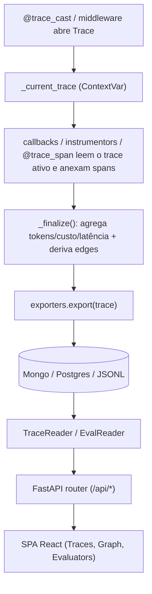
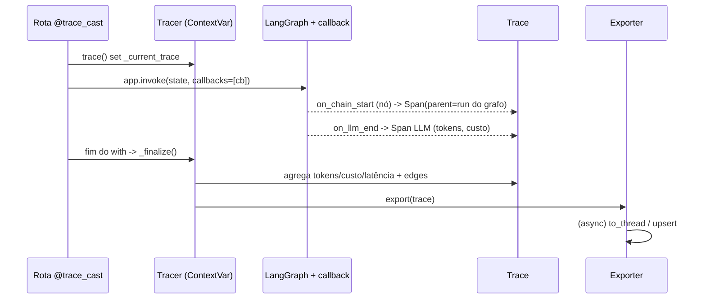

# TraceCast — Arquitetura e funcionamento interno

Explicação completa do que foi construído: como usar nos seus projetos, como ler o código e o que
acontece por baixo dos panos. Português, com referências aos arquivos reais.

---

## 1. Modelo mental

TraceCast tem três responsabilidades, em camadas independentes:

1. **Captura** (`tracecast/core`, `decorators.py`, `integrations/`, `instrumentors/`) — observa o que o
   seu agente faz e monta um `Trace` em memória.
2. **Persistência** (`tracecast/exporters/`) — grava o `Trace` num destino (Mongo/Postgres/JSONL/...).
3. **Consumo** (`tracecast/dashboard/`, `tracecast/serve.py`, `packages/tracecast-dashboard`) — lê de
   volta e mostra (lista, filtros, grafo, evaluators).

Sobre isso há um quarto bloco, o **subsistema de evaluation** (`tracecast/eval/`), que reusa as três
camadas: roda o agente sobre um golden dataset, julga as respostas e grava os resultados.

A peça central que conecta tudo é uma única ideia: **um `ContextVar` guarda o trace "ativo" da request**.
Quem captura spans só precisa perguntar "qual o trace atual?" e anexar. É isso que torna a captura
transparente — você não passa o tracer manualmente por toda a stack.



---

## 2. Estrutura de pastas

```
packages/tracecast-py/tracecast/
├── core/
│   ├── tracer.py          # Tracer, ContextVars, bind_context, mount/serve, tratamento de erro de export
│   ├── token_counter.py   # extrai tokens/conteúdo por provider (openai/anthropic/gemini/langchain)
│   ├── cost_calculator.py # PRICE_TABLE + calculate_cost (com cache pricing e prefix-match)
│   └── logger.py          # logging estruturado opcional (logging.getLogger("tracecast"))
├── models/
│   ├── span.py            # Span (parent_span_id, status, error, tokens, latency_ms, to_dict)
│   └── trace.py           # Trace (_finalize, _build_edges, schema_version=2, to_dict)
├── decorators.py          # @trace_cast (abre trace) e @trace_span (span filho)
├── middleware.py          # TraceCastMiddleware (ASGI: abre um trace por request HTTP)
├── instrument.py          # auto_instrument(): registry + patch dos instrumentors
├── instrumentors/         # monkeypatch de SDKs (openai/anthropic/gemini/crewai/llamaindex) + LangChain hook
├── integrations/
│   ├── langchain.py       # TraceCastCallback (LLM/Tool/Chain -> spans)
│   └── llm.py             # trace_llm_call + wrap_openai/wrap_anthropic (proxies)
├── exporters/             # base, json_file, dict, mongo, postgres, query (filtros)
├── dashboard/             # reader, eval_reader, router, aggregator, standalone, blueprint, asgi_middleware, static/
├── serve.py               # CLI tracecast-server + build_exporter_from_dsn (config por env)
└── eval/                  # models, dataset, decorator, scorers, judge, runner, cli
```

---

## 3. Modelo de dados (schema v2)

### Span (`models/span.py`)
Um evento atômico: uma chamada LLM, uma tool, ou um passo de agente/nó.

Campos-chave introduzidos no v2:
- `parent_span_id` — quem é o pai na árvore de execução. `None` = raiz (filho direto da request).
- `status` (`SpanStatus.OK`/`ERROR`) e `error` — erro vira cidadão de primeira classe (antes ficava
  escondido em `metadata["_error"]`).
- `latency_ms` é uma **property** calculada de `finished_at - started_at` (não é armazenado redundante).

### Trace (`models/trace.py`)
A request inteira. Contém a lista de `spans` e, após `_finalize()`:
- agregados: `total_tokens_in/out/_in_cached`, `total_tokens`, `cost_usd`, `latency_ms`, `tools_used`,
  `model` (o LLM que mais consumiu tokens — heurística);
- `edges`: a topologia **percorrida**, derivada (ver §4.5);
- `schema_version = 2`.

**Por que separar Span/Trace e por que edges derivadas?** Porque a maioria dos frameworks (LangChain)
te entrega eventos com `run_id`/`parent_run_id`, não um grafo pronto. Guardando o pai em cada span e
derivando as arestas pela ordem temporal dos irmãos, reconstruímos o caminho real sem depender de APIs
internas do framework.

---

## 4. Captura — como funciona por baixo dos panos

### 4.1 O ContextVar do trace ativo (`core/tracer.py`)

```python
_current_trace: ContextVar[Optional[Trace]] = ContextVar("_current_trace", default=None)
_current_span:  ContextVar[Optional[Span]]  = ContextVar("_current_span",  default=None)
```

`Tracer.trace()`/`atrace()` criam o `Trace`, fazem `_current_trace.set(trace)`, executam o seu código
no `with`/`async with`, e no `finally` chamam `_finalize()` + `_export()`. Qualquer código rodando
dentro do bloco enxerga o trace via `Tracer.current()`.

`_current_span` guarda o span "ativo" para permitir **aninhamento** de spans manuais: quando você está
dentro de um `@trace_span`, novas chamadas LLM viram filhas dele.

**Propagação:** ContextVars são copiados automaticamente para tasks `asyncio` filhas, então `atrace`
funciona em código async aninhado. **Não** são copiados para threads (`ThreadPoolExecutor`,
`loop.run_in_executor`). Para isso existe `bind_context`:

```python
def bind_context(fn, *args, **kwargs):
    ctx = contextvars.copy_context()      # captura AQUI (na thread que tem o trace)
    def _runner(): return ctx.run(fn, *args, **kwargs)
    return _runner                         # roda LÁ (na worker thread) dentro do contexto capturado
```

A captura tem que acontecer na thread de origem; por isso `bind_context` retorna um *runner* — você
submete o runner ao executor, não a função crua.

### 4.2 Os decorators (`decorators.py`)

- `@trace_cast(...)` — abre o trace. Detecta sync vs async (`asyncio.iscoroutinefunction`) e usa
  `tracer.trace`/`atrace`. Resolve o tracer por precedência: argumento explícito → `_default_tracer`
  (setado por `set_default_tracer`/`auto_instrument`) → um `Tracer()` novo.
- `@trace_span(name, type)` — cria um `Span` filho do span/trace ativo, ativa-o com `activate_span`
  (para que chamadas internas aninhem), roda a função, captura `input`/`output` (via `_truncate`, com
  limite de 2000 chars), latência e `status`. Em exceção: `span.mark_error(exc)` e re-`raise`. Se não há
  trace ativo, é **passthrough** (zero overhead).

`@trace_cast` usa `functools.wraps`, então a assinatura original é preservada — é por isso que funciona
direto numa rota FastAPI (o FastAPI inspeciona a assinatura via `__wrapped__`).

### 4.3 auto_instrument e o registry (`instrument.py`, `instrumentors/`)

`auto_instrument(tracer)`:
1. `set_default_tracer(tracer)`;
2. registra os instrumentors built-in num dict global (`_registry`) via `_register_all()`;
3. chama `inst.patch()` em cada um (ImportError é ignorado — só instrumenta o que está instalado).

Cada instrumentor faz **monkeypatch** no ponto de entrada do SDK:
- `openai_inst.py` troca `openai.resources.chat.completions.Completions.create` (e a versão async) por
  um wrapper que, se há trace ativo, cria um span LLM, executa o original, extrai tokens/conteúdo e
  anexa. Streaming é tratado à parte (§4.6).
- `anthropic_inst.py`/`gemini_inst.py` — mesma ideia em `Messages.create`/`generate_content`.
- `langchain_inst.py` é diferente: LangChain não tem um método único; ele usa um **configure-hook**.
  Registramos um `ContextVar` via `register_configure_hook` e nele colocamos um `_LazyHandler`. Toda vez
  que o LangChain monta um `CallbackManager` (a cada chain/LLM), ele inclui nosso handler. O
  `_LazyHandler` resolve o `TraceCastCallback` na primeira chamada e **reusa a mesma instância** — isso
  é crítico, porque o callback guarda spans abertos em `self._span_stack`; recriar o callback a cada
  acesso perderia os spans no `on_*_end`.

`active_parent_id()` (em `instrumentors/base.py`) é o helper que cada instrumentor usa para herdar o
span ativo como pai (`Tracer.current_span()`).

### 4.4 O callback do LangChain/LangGraph (`integrations/langchain.py`)

`TraceCastCallback` implementa os hooks do LangChain:
- `on_llm_start`/`on_tool_start`/`on_chain_start`: criam um `Span` (tipo LLM/TOOL/AGENT), guardam em
  `self._span_stack[run_id]`, e setam `parent_span_id = str(parent_run_id)` quando há pai. **É aqui que
  a hierarquia do grafo é capturada** — cada nó do LangGraph dispara um `on_chain_start` com
  `parent_run_id` apontando para o run do grafo.
- `on_*_end`: tiram o span do stack (`pop(run_id)`), preenchem `finished_at`, tokens (LLM), `output`, e
  anexam ao `Tracer.current()`.
- `on_*_error`: `_close_span_with_error` → `span.mark_error(error)`.

Tokens no `on_llm_end`: tenta `response.llm_output` (token_usage) e, se vier zero, cai para
`generations[0][0].message.usage_metadata` (caminho dos chat models modernos com `stream_usage=True`).

**Limitação honesta:** spans criados via `trace_llm_call` manual *dentro* de um nó LangGraph não herdam
o nó como pai (o callback e o span manual não compartilham `run_id`). Eles ficam como spans raiz. Os
nós do grafo, esses sim, têm hierarquia. Para o caso comum (LLM via LangChain), tudo aninha certo.

### 4.5 Derivação de arestas (`Trace._build_edges`)

```python
# agrupa spans por pai (pais desconhecidos viram raiz);
# dentro de cada grupo de irmãos, ordena por started_at;
# emite aresta entre cada par consecutivo (span[i] -> span[i+1]).
```

Isso reconstrói o **caminho executado**: em um roteamento condicional do LangGraph, só o ramo tomado
gera spans, então as arestas consecutivas representam exatamente a transição real. `conditional` fica
`False` por padrão (rotular condicionais de verdade exigiria introspecção do grafo compilado — deixado
como melhoria futura).

### 4.6 Streaming (`instrumentors/_streaming.py`)

Respostas em streaming não trazem `usage` nos chunks intermediários. A solução:
- OpenAI: injetamos `stream_options={"include_usage": True}` e envolvemos o iterador num gerador
  (`stream_openai`) que repassa os chunks, acumula `delta.content` e lê `usage` do chunk final;
- Anthropic: acumulamos `input_tokens` do evento `message_start` e `output_tokens` do `message_delta`.

O span só é finalizado quando o consumidor termina de iterar (no `finally` do gerador) — é a semântica
correta de latência para streams.

### 4.7 Tokens e custo (`core/token_counter.py`, `core/cost_calculator.py`)

`extract_tokens(response, provider)` normaliza os formatos de cada SDK para `{input, output, cached}`.
`calculate_cost(model, in, out, cached)` usa a `PRICE_TABLE` ($/1k tokens), com preço de cache
separado quando disponível e *prefix-match* (`ollama/*`). Custos customizados via `custom_prices`.

---

## 5. Persistência (`exporters/`)

### Contrato base (`base.py`)
`export(trace)` é obrigatório. `aexport(trace)` por padrão faz `await asyncio.to_thread(self.export, ...)`
— ou seja, **em app async o I/O do exporter não bloqueia o event loop**.

### Save em background (`background_export=True`) — seguro para produção
Por padrão o export é síncrono (no fechamento do trace), o que é determinístico e ótimo para testes,
mas em handler sync de produção adiciona o round-trip do banco (~1–10ms) ao caminho da request.

Com `Tracer(..., background_export=True)`, o save sai do caminho da request e vai para um
`_ExportWorker` (em `core/tracer.py`):

- **fila limitada** (`queue.Queue(maxsize=...)`, default 10.000, env `TRACECAST_EXPORT_QUEUE`);
- **um único worker daemon** consome a fila e executa `export` (1 consumidor → seguro para a conexão
  não-thread-safe do psycopg2 e preserva ordem);
- **enqueue não-bloqueante** (`put_nowait`): a request nunca espera o I/O;
- **drop sob overload**: se a fila enche, o trace é descartado (best-effort, com log rate-limited) em
  vez de crescer indefinidamente — **o app não trava nem dá OOM**;
- `flush(timeout)` / `flush_exports(timeout)` drenam a fila (enfileiram um marcador e esperam); um
  `atexit` enfileira um sentinela e dá join no worker para não perder dados no shutdown gracioso.

Isso vale igual para apps sync e async (em ambos, o caminho da request só enfileira). Drivers async
nativos (motor/asyncpg) são trabalho futuro — o worker com fila já resolve o "não bloquear / não cair".

### Tratamento de erro (`core/tracer.py:_handle_export_error`)
Falha de export **nunca** é silenciosa nem derruba o app: loga em nível `ERROR` e chama o hook
`on_export_error(exc, trace, exporter)` se configurado. Os demais exporters continuam.

### Exporters concretos
- `JsonFileExporter` — append em JSONL; `aexport` já offloada.
- `MongoExporter` — `replace_one({trace_id}, doc, upsert=True)` (idempotente); índices criados
  preguiçosamente no primeiro export (não conecta no `__init__`, não bloqueia startup).
- `PostgresExporter` — schema dinâmico (colunas escolhidas por include/exclude), `ON CONFLICT (trace_id)
  DO UPDATE` (upsert), conexão de **leitura dedicada** (`_read_conn` + `_read_lock`) separada da de
  escrita.
- `DictExporter` — em memória (testes/filas).

### Leitura com pushdown (`query/get/count`)
Mongo e Postgres expõem `query(...)`, `get(trace_id)`, `count(...)` para **filtrar no banco** (projeto,
usuário, sessão, intervalo de datas) com `LIMIT/OFFSET`. `exporters/query.py` centraliza o mapa de
ordenação (`sort_field`) e o filtro de evals (`match_eval`). Isso é o que faz o dashboard escalar além
dos "últimos 500".

---

## 6. Consumo / Dashboard (`dashboard/`, `serve.py`, `packages/tracecast-dashboard`)

### TraceReader (`reader.py`)
Camada de leitura com cache (TTL 5s). Se algum exporter tem `query`, usa **pushdown** (`query_page`,
`get_trace`); senão cai para leitura em memória (`_from_dict/_from_jsonfile/_from_mongo/_from_postgres`)
e `_hydrate_trace` reconstrói `Trace`/`Span` (retrocompatível com v1: defaults para os campos novos).

### Router (`router.py`)
Monta o `APIRouter` do FastAPI:
- `/api/traces` (pushdown quando possível), `/api/traces/{id}`, `/api/traces/{id}/graph`
  (`build_graph` → `{nodes, edges}`), `/api/metrics`, `/api/sessions`, `/api/projects`, `/api/health`;
- evals: `/api/evals`, `/api/evals/{run_id}`, `POST /api/evals/run` (§7.7);
- estáticos do SPA + fallback de rota.
- **Injeção de prefixo:** `_index_html(prefix)` insere `window.__TC_PREFIX__ = "<prefix>"` no HTML
  servido, para o SPA saber montar as URLs de API sob qualquer prefixo.

### Standalone vs embutido
- Embutido: `tracer.mount(app, prefix="/tracecast")` detecta FastAPI/Flask/ASGI e pluga o router.
- Standalone: `serve.py` lê `TRACECAST_STORE` (+ `_DB/_AUTH/_CORS/...`), constrói o exporter de leitura
  via `build_exporter_from_dsn` e sobe um FastAPI próprio (`standalone._build_app`) com basic-auth
  opcional (middleware) e CORS. **Não importa o app de produção** — só aponta para o mesmo banco.

### Frontend (`packages/tracecast-dashboard`, React + Vite, servido como estático)
- `hooks/useApi.ts` — fetch com base em `window.__TC_PREFIX__`.
- `components/TraceGraph.tsx` — grafo DAG com `reactflow`; layout por profundidade (BFS no
  `parent_span_id`), cor por tipo, borda vermelha em erro; clique no nó abre o detalhe.
- `pages/TraceDetail.tsx` — abas Graph/List.
- `pages/Evaluators.tsx` e `pages/EvalRunDetail.tsx` — lista de runs e detalhe por caso/turn/critério.

---

## 7. Subsistema de evaluation (`eval/`)

### 7.1 Modelos (`eval/models.py`)
`EvalRun` ⊃ `EvalCase` ⊃ `TurnResult` ⊃ `CriterionScore`. `compute(threshold)` agrega por turn e por
caso; `EvalRun.finalize()` calcula `pass_rate`, `avg_score`, totais e latência. Tudo com
`to_dict/from_dict` (round-trip).

### 7.2 Dataset (`eval/dataset.py`)
`load_dataset(path)` normaliza dois formatos para um modelo único `GoldenCase(turns=[GoldenTurn])`:
single-turn (`{input, expected}`) vira `user → assistant(expected)`; multi-turn é a lista de turns.

### 7.3 Decorator (`eval/decorator.py`)
`@evaluator(dataset=..., scorers=[...], criteria=[...], threshold=..., project_id=...)` registra um
`EvalTarget(name, fn, ...)` num registry global. Em runtime normal é **transparente** (só chama `fn`).

### 7.4 Scorers (`eval/scorers.py`)
Determinísticos: `exact_match`, `contains`, `regex`, `similarity` (difflib). Cada um devolve
`CriterionScore(kind="deterministic")` 0–1.

### 7.5 Judge (`eval/judge.py`)
`LLMJudge` monta um prompt com a rubrica, pede JSON, e parseia com `_extract_json` (tolera cercas
```json``` e texto ao redor). Robustez:
- critério ausente no JSON → score 0, `reasoning="parse_error"`;
- JSON inválido → todos 0;
- **falha na chamada do LLM** (sem API key, timeout) → degrada para 0 + `reasoning="judge_unavailable"`
  sem levantar exceção (não derruba a run);
- score é *clampado* em [0,1]; custo calculado via `calculate_cost`.
`call_fn` é injetável → testável com judge fake e trocável por outro provider.

### 7.6 Runner (`eval/runner.py`)
`run_evaluation(target, exporters, dataset?, judge?, ...)`:
- resolve o target (objeto ou nome no registry) e o dataset;
- para cada caso, abre um **trace** (`tracer.trace`) → o grafo da execução é capturado e o `trace_id`
  fica linkado no `EvalCase`;
- monta o histórico de turns; descobre se a função quer a conversa inteira (`messages`/`history`/
  `conversation`) ou só o último texto (`_wants_history` via `inspect.signature`);
- para cada turn de assistant: chama o SUT → `output`; roda scorers + judge → `CriterionScore`s;
- caso com exceção vira `status="error"` sem abortar os demais;
- agrega e persiste via `exporter.export_eval(run)` (erros logados, não silenciosos).

### 7.7 Disparo (CLI / script / endpoint)
- **Script**: `from tracecast import run_evaluation`.
- **CLI** (`eval/cli.py`, `tracecast-eval`): importa o módulo do target (`módulo:nome`), constrói o
  exporter via `build_exporter_from_dsn`, roda, e retorna **exit code ≠ 0 se `pass_rate < threshold`**
  (gate de CI).
- **Endpoint** `POST /api/evals/run`: só funciona com o dashboard **embutido** (precisa do target no
  registry em memória). Standalone → 501.

### 7.8 Store de evals
Coleção/tabela separada (`*_evals`), mesmos exporters, upsert por `run_id`. `EvalReader` espelha o
`TraceReader` para a API de leitura.

---

## 8. Fluxo de uma request (sequência)



---

## 9. Como integrar no seu projeto (resumo)

1. `Tracer(exporters=[MongoExporter(...)])` + `auto_instrument(tracer)`.
2. `@trace_cast` na rota/handler de entrada; `@trace_span` em guardrails/funções; `bind_context` se
   offloadar para threads.
3. Dashboard: `tracer.mount(app)` em dev, ou `tracecast-server` numa VM lendo o storage remoto.
4. Evaluation: golden dataset JSON + `@evaluator` + `run_evaluation` (ou `tracecast-eval` em CI).

Exemplos runnable e detalhados em `demo/` (veja `demo/HOW-TO-USE.md`).

---

## 10. Como estender

- **Novo exporter**: herde `BaseExporter`, implemente `export`. Para aparecer no dashboard com filtros,
  adicione `query/get/count` (e `export_eval/query_evals/get_eval` para evals).
- **Novo scorer**: adicione a função em `eval/scorers.py` e registre em `SCORERS`.
- **Novo judge**: qualquer objeto com `score(*, input, output, expected, criteria) -> JudgeResult`.
- **Novo framework de captura**: ou um instrumentor (monkeypatch) em `instrumentors/`, ou um callback
  que leia `Tracer.current()`/`current_span()` e anexe spans.

---

## 11. Decisões de design (resumo; detalhes nos ADRs em `.specs/project/STATE.md`)

- **Python-only** (ADR-001): captura é in-process, então a linguagem da SDK segue a do app; a SDK TS foi
  removida; o dashboard backend ficou só em Python (frontend React é servido como estático).
- **Schema v2** (ADR-003): hierarquia + status + edges para reconstruir o grafo.
- **Save best-effort + visível** (ADR-004): sem perda silenciosa, async não-bloqueante; fila durável é
  trabalho futuro.
- **Eval reusa as 3 camadas** (ADR-005): cada caso é um trace; resultados em store separado.

---

## 12. Gotchas / limitações conhecidas

- ContextVar não cruza threads → use `bind_context`.
- LLM manual (`trace_llm_call`) dentro de um nó LangGraph não herda o nó como pai (fica raiz); LLMs via
  LangChain aninham corretamente.
- Streaming só captura tokens nos providers tratados (OpenAI/Anthropic); Gemini stream é passthrough.
- Endpoint de trigger de eval exige dashboard embutido (registry em memória); standalone é read-only.
- `arestas condicionais` não são rotuladas como tais (derivadas por ordem temporal).

---

## 13. Onde rodar os testes

```bash
cd packages/tracecast-py && python -m pytest -q     # 295 testes
python demo/test_endpoints.py                        # integração real da API FastAPI
```

Os testes em `tests/` (unitários/integração) usam mocks/fakes determinísticos; as demos em `demo/`
exercitam o caminho real de ponta a ponta.
